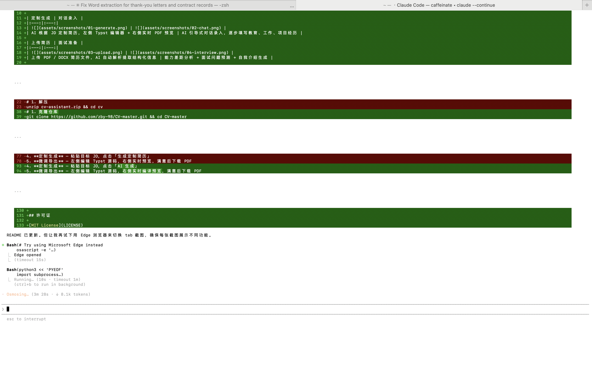
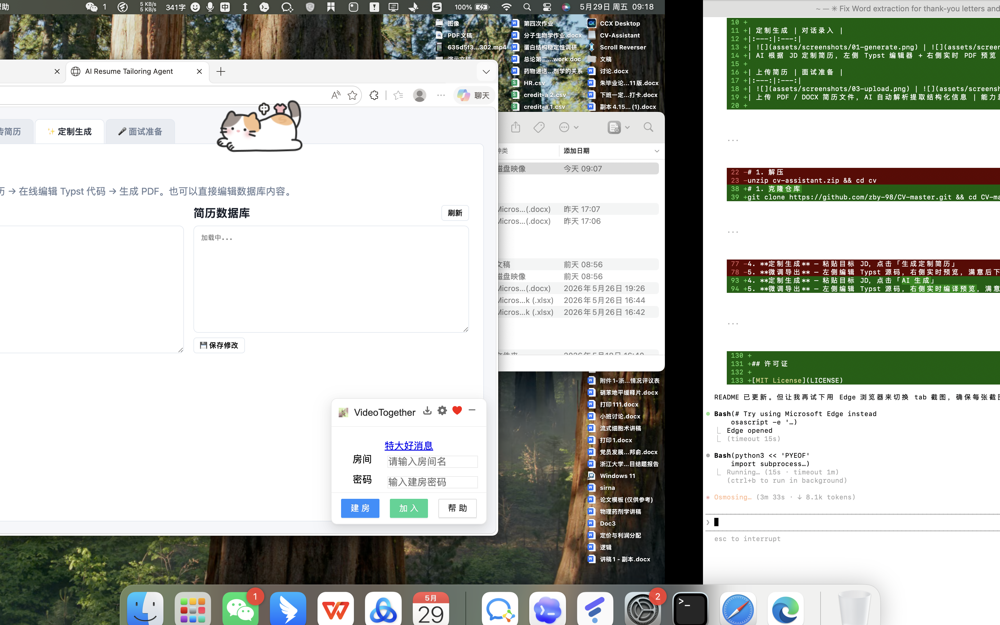

# 🎯 AI 简历定制助手

根据职位描述（JD）智能定制简历的 Web 工具。支持多用户、对话录入、实时 Typst 编译预览、面试准备分析。

## 📸 功能演示

> 将截图放入 `assets/screenshots/` 目录后，取消下方注释即可展示。

<!--
| 定制生成 | 对话录入 |
|:---:|:---:|
|  |  |
| AI 根据 JD 定制简历，左侧 Typst 编辑器 + 右侧实时 PDF 预览 | AI 引导式对话录入，逐步填写教育、工作、项目经历 |

| 上传简历 | 面试准备 |
|:---:|:---:|
|  |  |
| 上传 PDF / DOCX 简历文件，AI 自动解析提取结构化信息 | 能力差距分析 + 面试问题预测 + 自我介绍生成 |
-->

## 功能

- **简历数据库管理** — 上传简历文件（PDF/DOCX）AI 自动解析，或通过对话逐步录入
- **智能定制** — 输入 JD，AI 自动筛选匹配经历、STAR 法则重写，生成 Typst 简历并编译为 PDF
- **实时预览** — 左侧编辑 Typst 源码，右侧 1.5 秒自动编译预览
- **面试准备** — 分析能力差距、预测面试问题、生成自我介绍
- **多用户** — 每个用户独立数据库，互不干扰

## 系统要求

- Python 3.10+
- Typst CLI（用于 PDF 编译）
- 兼容 OpenAI 接口的 AI API（豆包 / DeepSeek / OpenAI 等）

## 安装

```bash
# 1. 克隆仓库
git clone https://github.com/zby-98/CV-master.git && cd CV-master

# 2. 安装 Typst（macOS）
brew install typst

# 其他系统：从 https://github.com/typst/typst/releases 下载

# 3. 一键安装
chmod +x start.sh install/setup.sh
./install/setup.sh
```

安装过程会自动：
- 创建 Python 虚拟环境
- 安装依赖包
- 检查 Typst CLI
- 生成配置文件模板

## 配置

编辑 `.env.yaml`（安装脚本已自动从模板创建）：

```yaml
api_key: "你的API密钥"
base_url: "https://ark.cn-beijing.volces.com/api/v3"  # 豆包官方
model: "doubao-seed-2.0-pro"
```

**支持的 API 提供商：**

| 提供商 | base_url | model 示例 |
|--------|----------|-----------|
| 豆包（火山引擎） | `https://ark.cn-beijing.volces.com/api/v3` | `doubao-seed-2.0-pro` |
| DeepSeek | `https://api.deepseek.com` | `deepseek-chat` |
| OpenAI | `https://api.openai.com/v1` | `gpt-4o` |
| 其他兼容接口 | 自定义 | 自定义 |

> 任何兼容 OpenAI Chat Completions API 的服务都可以使用。

## 启动

```bash
./start.sh
```

打开浏览器访问 **http://localhost:8080**

## 使用流程

1. **配置 API** — 左下角设置面板，填入 API Key / Base URL / Model，点「测试连接」
2. **创建用户** — 左上角下拉框，输入新用户名创建
3. **录入简历** — 两种方式：
   - 上传 PDF/DOCX 简历文件，AI 自动解析
   - 对话式录入，AI 引导你逐步填写
4. **定制生成** — 粘贴目标 JD，点击「AI 生成」
5. **微调导出** — 左侧编辑 Typst 源码，右侧实时编译预览，满意后下载 PDF
6. **面试准备** — 切换到面试准备选项卡，输入 JD，获取差距分析和面试问题预测

## 项目结构

```
cv/
├── app.py              # Flask Web 应用
├── core.py             # 核心业务逻辑
├── build_resume.py     # 命令行工具
├── start.sh            # 启动脚本
├── README.md
├── prompts/            # AI 提示词模板
├── templates/          # Web 页面模板
├── fonts/              # 自定义字体（可选）
├── data/               # 用户数据（自动创建）
└── install/            # 安装与打包
    ├── setup.sh        # 一键安装脚本
    ├── package.sh      # 分发包生成脚本
    ├── requirements.txt
    └── .env.yaml.example
```

## 常见问题

**Q: 提示「Typst CLI 未安装」？**
安装 Typst：`brew install typst`（macOS）或从 https://github.com/typst/typst/releases 下载。

**Q: AI 调用报 502 错误？**
API 代理超时。本工具已使用流式请求避免此问题，如仍出现，尝试换一个 API 提供商。

**Q: PDF 编译报字体错误？**
在 `fonts/` 目录下放入所需的中文字体文件（如 Heiti SC.ttf），Typst 会自动加载。

**Q: 如何备份数据？**
复制 `data/` 目录即可，每个用户独立一个子目录。

## 许可证

[MIT License](LICENSE)
